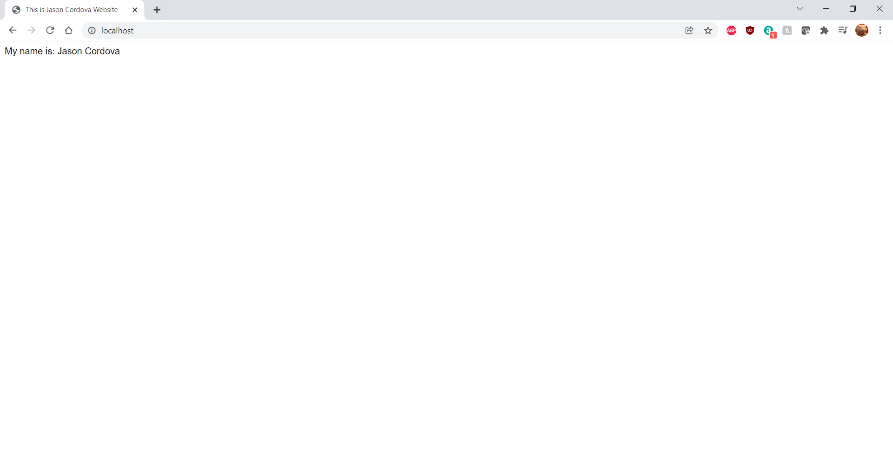

# Docker Nginx Flask Project Setup

<<<<<<< HEAD
To run tests, Lint, and Coverage report use this command:

pytest  --pylint --cov

.pylintrc is the config for pylint
.coveragerc is the config for coverage
setup.py is a config file for pytest
test
=======
>>>>>>> 7570df10deaf35c3a683e5de7121debeb5df4f75
Just Run:

docker compose up --build to get it to run and go to locahost to see the site.

## Screenshot of Running Program

